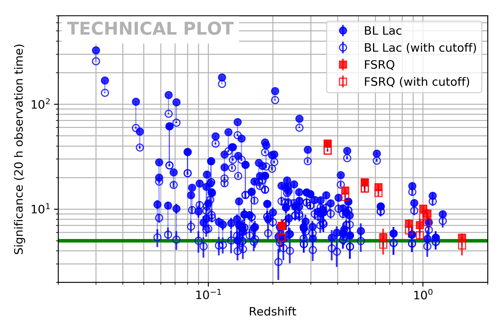

# Extrapolation of blazars from Fermi/LAT catalogues

In this example we simulate CTA data corresponding to an extrapolation of Fermi/LAT spectra. The impact of an hypothetical cut-off in the spectra on the level of the detection will be shown. Two scripts are used: 
 - [ana.py](./ana.py) to simulate and save data
 - [plot.py](./plot.py) to plot the results

## Source selection
Sources are selected from 3FGL catalogue. The following criteria are used for the selection of te sources:
 - classes of sources, BL Lacs or FSRQs
 - sources having an estimate for their redshift in the 3FGL catalogue
 - sources whose meridian transit occurs with zenith distance less than 30 degrees at least in one CTA site (sources having a declination below 0° are considered as "South source")

## Instrument response functions
The public IRF (labelled as 5 hours) from production 2 are used. Results differs from the proceeding since the production 3b was used.

## Simulations
The simulations have been done assuming the 3FGL Fermi/LAT spectrum as intrinsic. Simulations was also done by adding a cutoff at 1 TeV /(1 + z) to the Fermi/LAT spectra. The following critera were used for the simulations:
 - absorption of the spectra by the EBL model from [Dominguez et al. (2011)](http://adsabs.harvard.edu/abs/2011MNRAS.410.2556D)
 - 20 h of exposure
 - integration of counts from 50 GeV to 100 TeV
 - signifiance averaged on 20 trials with [Li and Ma (1983)](http://adsabs.harvard.edu/abs/1983ApJ...272..317L) estimator
 
## Output
The outputs are stored in a FITS file which is further used to plot the result of the simulations, which is shown below.

