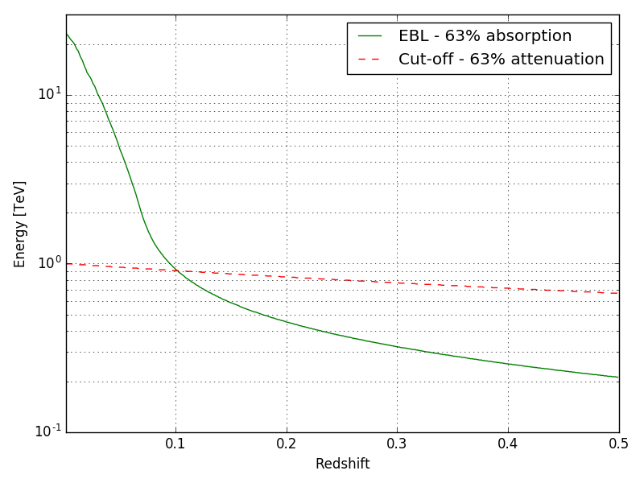

# The EBL scale factors
In this example we show how [Sherpa](https://github.com/sherpa/sherpa) can be used to handle complex models that can used to adjust IACT data with a full forward-folding method. Simulation of fake data are generated and exported in OGIP format with Gammapy. 

## Reconstruction of the EBL scale factor
ToDo

## Attenuation due to the EBL and to an intrinsic cut-off
ToDo

