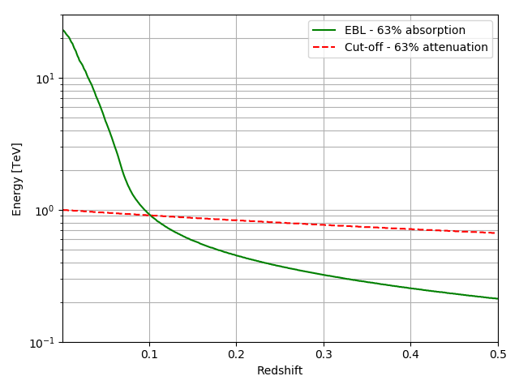

# The EBL scale factors

In the first example we show how [Sherpa](https://github.com/sherpa/sherpa) can
be used to handle complex models that can used to adjust IACT data with a full
forward-folding method. Simulation of fake data are generated and exported in
OGIP format with Gammapy. In the second example we compare the photon
attenuation due to the EBL ([Dominguez et al.
(2011)](http://adsabs.harvard.edu/abs/2011MNRAS.410.2556D)) and to a cut-off as
a function of redshift and photon energy.

## Reconstruction of the EBL scale factor

We do not reproduce the same the results as shown in the proceeding but instead
show how Gammapy can easily be used to obtain constrain on the EBL scale of a
given model ([Dominguez et al.
(2011)](http://adsabs.harvard.edu/abs/2011MNRAS.410.2556D)). To do so, we
simulate two sources with the same intrinsic spectrum but with two different
redshift, z=0.2 and z=0.3, and we then apply the EBL absorption. Afterwards, we
export the data to the OGIP format. Each dataset as its own identifier.

The second part of the script is dedicated to realise a jointly fit to the
intrinsic spectra of the sources as well as an  EBL scale factor commun to the
two sources. We begin with the definition of a Sherpa model corresponding to the
EBL attenuation with a scale alpha which can be regards as an amplitude to the
EBL model. After that, we load the simulated datasets, set the model for each
dataset (intrinsic spectra + EBL absorption) and initialize the parameters of
the models (same parameters that we used in input). We then link the two
normalisation ad proceed to the fit. We recover the fitted parameters and print
the ouput of the fit.

## Attenuation due to the EBL and to an intrinsic cut-off

In this exmaple we plot the curves corresponding to a loss of 63 % of the
photons due to the EBL and due to and intrisic cut-off.

