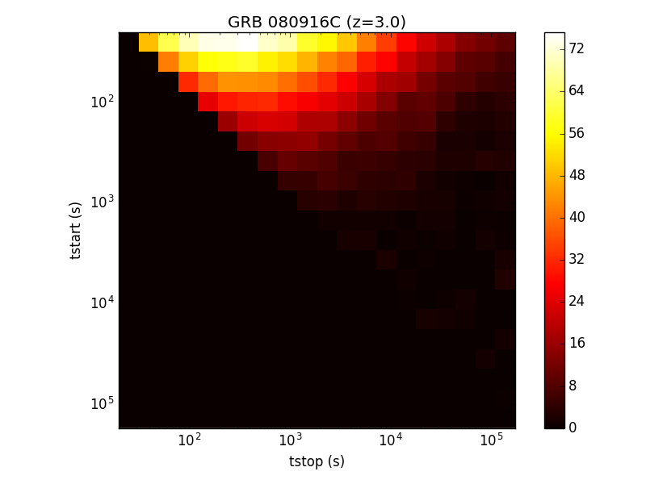

# Observational window for gamma-ray bursts

In this example we reproduce a result from E. Bissaldi [1] to study the signifiance of detection of an hypothetical GRB as a function of the observational time windows.

## GRB template
The template of the GRB is close to [GRB 080916C](http://adsabs.harvard.edu/abs/2009Sci...323.1688A) detected by the Fermi/LAT. The following spectral criteria are used: 
 - spectral index of 2.0
 - integrated flux between 0.1 GeV and 10 GeV of 500e-5 /cm2/s
 - redshift of 3.

The temporal decay of the integrated flux is expressed as a power law with a decay index of 1.7. The time of the emission peak is took as 6.5s.

## Instrument response functions
The public North IRF (labelled as 30 minutes) from production 2 are used.

## Simulations
We defined observational time windows ranging from 20s to two days after the peak emission. Twenty logarithmic binning are used. For each physical interval the significance is computed according to average time of the intervals and the spectral template depending with time.

## Output
The output are shown below.

[1] E. Bissaldi et al., "Prospects for Gamma-Ray Burst detection by the Cherenkov Telescope Array," in 11th Workshop on Science with the New generation of High Energy Gamma-ray Experiments (Il Nuovo Cimento C, 2017)
